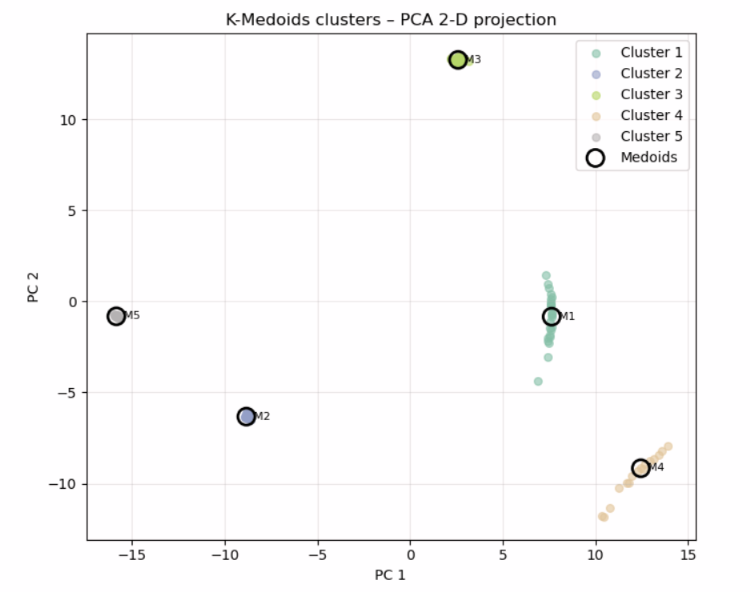
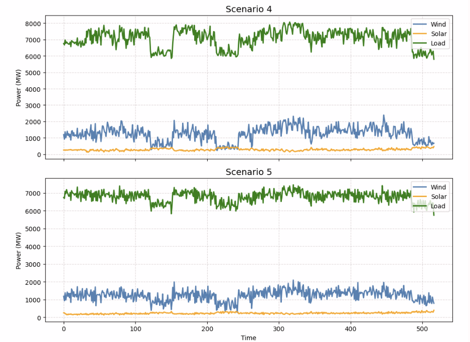

# Data-driven-Modelling-and-Optimization-for-Renewable-energy-systems

This repository contains the complete workflow for data-driven scenario generation, evaluation, and reduction for renewable power systems in Alberta.
The work focuses on generating realistic and diverse wind, solar, and load residual scenarios, reducing them into representative subsets, and preparing them for multi-objective optimization using NSGA-II to study trade-offs between system cost and reliability.


---

## 🔍 Project Overview

### **1. Problem Motivation**
Integrating high shares of renewable energy (wind and solar) into Alberta’s grid introduces variability and uncertainty into power system operation. To design cost-effective and reliable systems, realistic **future scenarios** must be generated and analyzed.

---

### **2. Workflow Summary**

#### **A. Data Processing & EDA**
- Historical AESO wind, solar, and load data were cleaned, detrended, and converted into **residual time series**.
- Calendar and seasonality patterns were analyzed.
- Outliers and missing values were handled.

#### **B. Scenario Generation**
- **TimeGAN** was trained to generate **synthetic residual sequences** for wind, solar, and load.
- The model was tuned to ensure generated sequences preserved realistic **seasonality** and **variability**.
- Outputs: `residual_sims.npy` containing hundreds of generated scenarios.

#### **C. Scenario Evaluation**
- Statistical moments (**mean, std, skewness, kurtosis**) were compared between real and synthetic data.
- Additional similarity metrics (e.g., DTW distances) were applied.

#### **D. Scenario Reduction**
- Goal: Select **k representative scenarios** from the generated set.
- Method:
  1. Compute pairwise **Euclidean distances** between scenarios.
  2. Apply **K-Medoids clustering** with k-medoids++ initialization (PAM refinement).
  3. Save the selected medoids (`selected_scenarios.npy`) as the reduced set.
- Visualization: PCA projection of scenarios with cluster labels and medoid markers.

#### **E. Next Step (Planned)**
- Integrate the representative scenarios into a **two-stage NSGA-II optimization**:
  - **Stage 1:** Determine optimal capacities for wind, solar, and storage.
  - **Stage 2:** Simulate dispatch decisions for each scenario.
  - Objective: Minimize cost while maximizing reliability.

---

## 📊 Example Results

**Scenario Reduction Visualization (PCA projection)**  
Shows clustering of generated scenarios in 2D space with medoids (representative scenarios) highlighted.


**Representative Scenario Plots**  

For each medoid scenario, wind, solar, and load residuals are plotted together to visualize temporal dynamics.


---

## 🛠️ Technologies Used

- **Python 3.10**
- **PyTorch** – TimeGAN training
- **scikit-learn** – PCA, preprocessing
- **Joblib** – Parallel processing, model saving
- **Matplotlib / Seaborn** – Visualization
- **NumPy / Pandas** – Data handling

---

## 🚀 How to Use

1. **Clone this repository**
   ```bash
   git clone https://github.com/yourusername/renewable-scenario-modeling.git
   cd renewable-scenario-modeling
